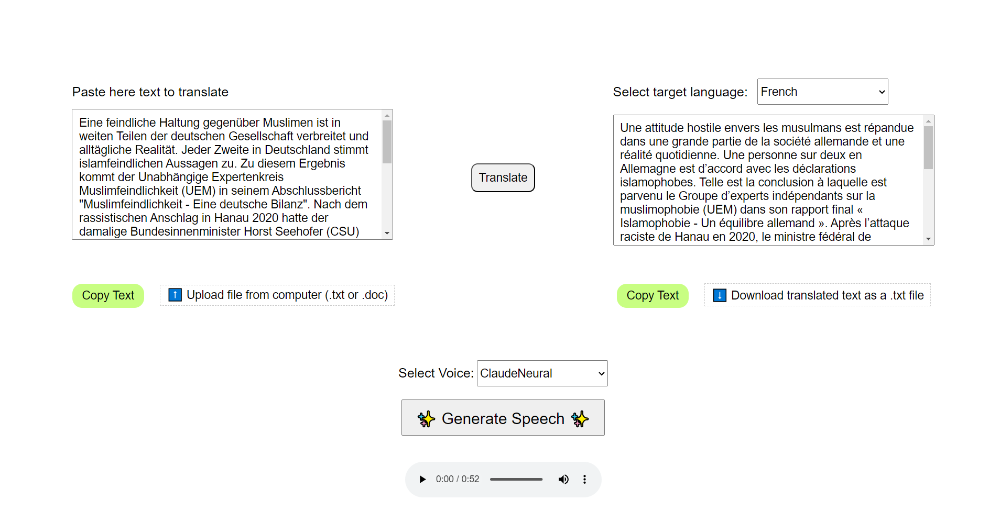

# text2speech webapp
* ## Files parsing and processing
* ## Machine Translation
* ## Speech generation using different SSML configurations

---
## Don't forget to create an `.env` file and store there the Azure ML **API keys**, for example:
> SUBSCRIPTION_KEY=a1a1a1a1a1a1a1aa1a1a1a1a1a1a1a1a

> SERVICE_REGION=canadacentral

> TEXT_ANALYTICS_ENDPOINT=https://....

> TRANSLATOR_ENDPOINT=https://....

These keys will be automatically read by `app.py`.

---

## Example of usage
